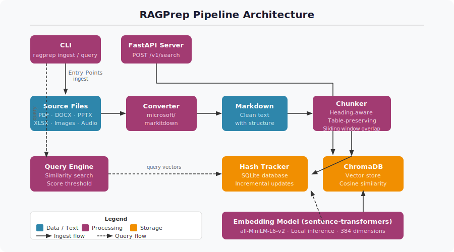

# RAGPrep

> Made Autonomously Using [NEO - Your Autonomous AI Engineering Agent](https://heyneo.com)
>
>   

Point it at a folder of mixed-format documents. Get back a queryable vector store. One command, under five minutes, no OpenAI key required.

## The Problem Everyone Rebuilds From Scratch

Every retrieval-augmented-generation project begins with the same three weeks of unpaid boilerplate:

- Write a PDF parser. Discover the PDF has two columns. Rewrite the PDF parser.
- Handle DOCX. Realise your text extractor destroys tables. Handle tables separately.
- Try PPTX. Give up on PPTX.
- Read three blog posts about chunking strategy. Pick one. Later discover it split a table in half.
- Wire up an embedding model. Forget whether it needs normalised vectors. Debug for an hour.
- Pick a vector database. Read its docs. Build an ingestion script. Realise it re-embeds every document on every run. Add a hash tracker. Get the hash logic subtly wrong.

At the end of all of this you have built a document ingestion pipeline that barely works and has nothing to do with the product you wanted to ship.

Microsoft's [`markitdown`](https://github.com/microsoft/markitdown) — 3,600 GitHub stars in April 2026 — solved the parsing half of that list. It takes any file format (PDF, DOCX, PPTX, XLSX, images, audio, HTML) and produces clean Markdown. **RAGPrep wires the rest together.** It takes `markitdown`'s output, chunks it intelligently, embeds it locally, indexes it into ChromaDB, tracks file hashes for incremental updates, and exposes both a CLI and an OpenAI-compatible HTTP endpoint on top.

## Why The Chunking Actually Matters

Cheap chunking is the silent killer of RAG quality. Most tutorials teach a fixed-character-count sliding window, which is the equivalent of cutting a book into pages with scissors every 500 characters. Retrieve a chunk and you get half a sentence, a truncated table row, and a heading that belongs to the next section.

RAGPrep's chunker is Markdown-aware by design:

- **Heading-aware splitting.** A section and its heading stay together. Retrieval surfaces the context the heading provides, not an orphaned paragraph.
- **Table-preserving chunking.** A Markdown table is never split mid-row. Either the whole table is in the chunk or none of it is. Half a table is worse than no table.
- **Sliding window with overlap** for dense prose where heading boundaries are sparse, so no fact falls across a chunk boundary without being fully present on one side.

The result is that retrieval returns passages a language model can actually use, not fragments it has to stitch back together.

## Local By Default

RAGPrep never calls a paid API unless you explicitly configure it to. Embeddings run through `sentence-transformers` locally (`all-MiniLM-L6-v2` by default — fast, 384 dimensions, good enough for almost every use case; swap in `all-mpnet-base-v2` if you want higher quality). Storage is ChromaDB, running in local mode. File-hash tracking lives in a SQLite file next to the vector store.

That design choice is deliberate. If you are indexing internal documents — contracts, research, customer data — shipping every page to OpenAI's embedding endpoint to then query your own corpus is a strange thing to agree to, and RAGPrep makes it unnecessary.

## Incremental Updates That Actually Work

The hash tracker records the SHA of every file at ingest time. Run `ragprep ingest` again and it only re-processes files whose contents changed. Point it at a 10,000-document folder where ten files were edited and it does ten files of work, not ten thousand. Files deleted from the source directory can optionally be removed from the index with `--delete-missing`.

This is the feature that turns RAGPrep from a one-shot ingestion script into something you can run on a cron.

## Two Ways To Use It

**As a CLI.** Four commands cover the lifecycle — `ingest`, `query`, `serve`, `status` — each with sensible defaults. `ragprep ingest ./docs/` is usually all you need on day one.

**As a FastAPI server.** `ragprep serve` exposes an OpenAI-compatible `/v1/embeddings` endpoint and a `/v1/search` endpoint. Any RAG application that already speaks to OpenAI's embeddings API can point at RAGPrep instead with a base-URL change — no client rewrite required.

There is also a Python API (`IngestPipeline`, `QueryEngine`, `StorageManager`, `DocumentConverter`, `MarkdownChunker`, `HashTracker`) for projects that want to embed the pipeline directly.

## When To Reach For It

You want RAGPrep when you have a folder of mixed-format documents and you need a retrieval layer, now, without spending the first month of the project writing parsers. You want it when you cannot or will not ship your documents to a third-party embedding API. You want it when your corpus changes and you need incremental reindexing rather than a full rebuild every night.

You do not want RAGPrep if your corpus is already clean Markdown and you are happy with hosted embeddings — at that point you are paying for complexity you do not need.

## Tech Stack

Python 3.10+, `markitdown` for document conversion, `sentence-transformers` for local embeddings, ChromaDB for the vector store, SQLite for hash tracking, and FastAPI for the server. Install from `requirements.txt` or `pip install -e .`

## License

MIT.

## Acknowledgments

- [microsoft/markitdown](https://github.com/microsoft/markitdown) for the document conversion layer this project stands on
- [sentence-transformers](https://www.sbert.net/) for the local embedding models
- [ChromaDB](https://www.trychroma.com/) for the vector store
- [FastAPI](https://fastapi.tiangolo.com/) for the HTTP layer
